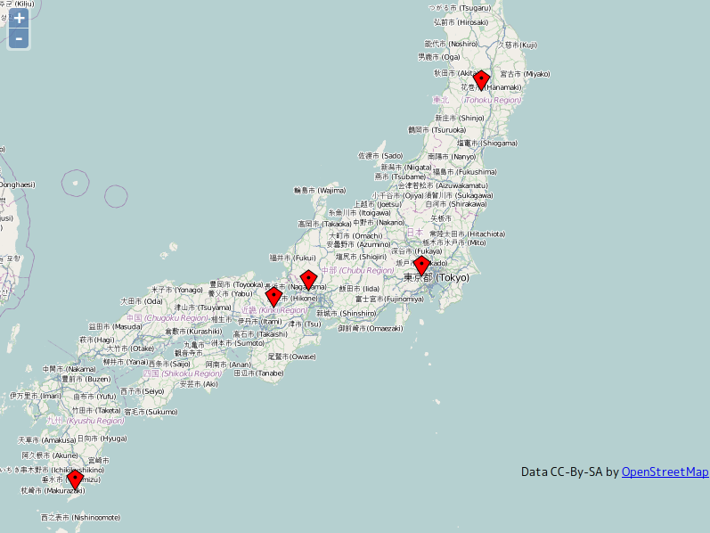
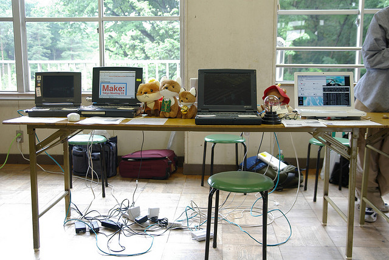
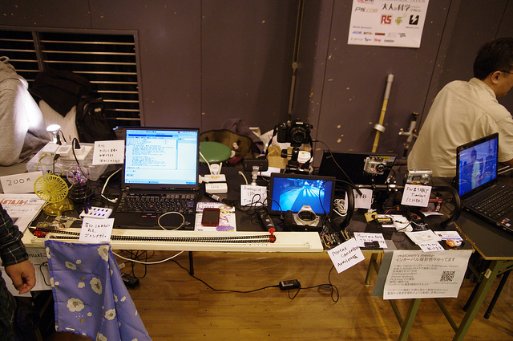

9月のオフな集まり(第122回)
------
独立行政法人情報処理推進機構(IPA)会議室A  
KenichiroMATOHARA(@matoken)  
http://matoken.org/  

最近
------

最近あちこち行ってました
------------------------

* 鹿児島(帰省)
* 仙台(OSC)
* 京都(OSC)
* 大垣(Make: Ogaki Meeting)

鹿児島帰省
----------------

鹿児島帰省
----------------

OSC 仙台
--------------

OSC 京都
--------------

Make: Ogaki Meeting
---------------------

Make: Ogaki Meeting
---------------------

map
-----------------

他
-------
* コミケ
* OSC Tokyo Fall

今年は後以下の辺りに参加?
------------------------------

* OSC 大分
* KOF

コミケ
----------------

* 今回の夏コミ新刊残り僅か
* 前回の冬コミ残りいっぱい><

* 夏コミ分168冊
* 献本等16冊
* OSC Tokyo 14冊

夏コミ分はもうほとんど残っていない．  
＃冬コミ分は未だ未開封な50冊入りの包みも…．まあ続けていれば捌けるでしょう．

編集作業
----------------

* ノンブル設定
* アンカ非表示
* 画像のグレースケール化
* フォント揃え

諦めたこと
-----------

* フォーマットの違う原稿の編集
* 動作検証
* スペルチェック

忘れていたこと
--------------------

* 島田くんの名前載せ忘れ(ごめんなさい\_o_)
* サポートページのURL 掲載忘れ

やりたいこと
-----------------

* 増ページ
* CD スリーブを本に一体化
* スペルチェック
* 自動生成
* 〆切を設ける

CD スリーブを本に一体化
-----------------------

* 印刷屋さんはやってくれるとのこと
* 値段や納期確認

スペルチェック
---------------

* 入稿後 aspel で試してみた
* かなり間違いが出てくるorz
* 大文字小文字などはケースバイケースなので機械的に一括変換はできない
* 辞書にない言葉なども
* Google で沢山出てくるからと行ってそれが正しいとは限らない(最近変わったとか)

電子化
----------

* もうすぐ夏分が売り切れるのでそろそろ準備をしないと
* 原稿の修正
  * 正誤表の反映
  * アンカを貼り直し，グレースケールをカラーに戻す
  * (余白を削る?)
* pdf/ePub?

電子版配布
-----------

* パブー
* emes
* GitHub
* slideshare
* 自サイト
* Ubuntuソフトウェアセンター
*  :

未だ比較などはしていない．  
手間が掛からないなら複数サイトで配布しても  
＃いいところがあったら教えて下さい

コミケ当日
----------------
* ML を知らない方がいた.説明したら理解してもらえた.
  * 説明詳しくしたほうがいいのかも
  * irc は更に難しいか…
* Linux 勉強しないといけないんだけど,始めたいんだけどという方がちらほら.
  * 内容的に一寸言う感じだった(そりゃそうだ><)
  * お隣の踊るかばねさんの本をどうぞ的な
    * 仮想マシンじゃなくて実機でやりたいからまた違うという方も.
* 2人でDebianT 着てたので「これはDebianBaseのものか?」と聞かれた.紛らわしかったかもしれない.

その他
--------------

* キャリーカート破壊 
  * もっと丈夫なものが必要><
* ポスカ,ステッカー,作る? 
  * 時間的にアウト
* ポスター.控えめにA2 で出力
  * 机の前に貼ると矢張り人が居ると見えないのでポスタ的なものが必要.背後か胆石なら横に置いてるところが多かった. 
* コミケカタログROM版
  * MR が掲載されるように.
  * 解像度も高くて読みやすく.
  * Wine での実行
  * アーカイブマウンタ経由だと起動しない
  * loop back mount ではok
  * csv ファイル読み込みが終わると何故か落ちる….
    * 結局iPad版で><

* Web 更新
  * 去年の冬コミ前の情報
* 売り子呼びかけは周りにはよく思われていないらしい
  * 繊細だから…
  * 気にするのもまた…
  * そういう声があるのは知っておきましょう
*DVD-ROMカタログ収録締切 / ネットワーク更新最終締切 の辺りをサボった
  * 次回からはWeb カタログも始まるのでちゃんとしたほうがいい
* カットは実際に印刷してみる
  * PC 画面やROM版カタログで問題ないと思っても印刷すると結構読めない><
  * 今は600dpi で出すだけなので楽に > https://plus.google.com/u/0/103792214056489833385/posts/9GZn57zTb3V
* 体調管理はしっかりと
  * 風邪でダメダメでしたorz
  * コミケ後も1週間以上引きずってしまった><
  * のためにもスケジュールをですね…

次のコミケのスケジュール
--------------------------

* 10月上旬 c83向けサークル情報入力開始
* 11月上旬 c83向けWebカタログ公開
* 12/29 c83 1日目
* 12/30 c83 2日目
* 12/31 c83 3日目(240 同人ソフト)

小江戸的スケジュール
-------------------------

* 今から執筆宣言開始
* <del>タイトル〆切</del>
* 入稿2週間前原稿&CDイメージ(CD説明も)〆切
  * 宣言済みでも間に合わなかったら落とす
* 入稿12月頭

Make: Tokyo Meeting
-------

これまでに東京で7回開催  
＃プレイベントも多摩川で(MTM00?)

これまでの出展
--------------

* MTM03
* MTM04
* MTM05
* MTM07

MTM03
---------

MTM04
--------------

MTM05
--------------

  
[MTM05出展 - matoken's wiki.](http://hpv.cc/~maty/pukiwiki1/index.php?cmd=read&page=MTM05%BD%D0%C5%B8)

MTM07
--------------

  
[インターバル撮影 - matoken's wiki.](http://hpv.cc/~maty/pukiwiki1/index.php?cmd=read&page=%A5%A4%A5%F3%A5%BF%A1%BC%A5%D0%A5%EB%BB%A3%B1%C6&word=MTM)

今年
----------------

今年はMaker Fair Tokyo 2012 とリニューアル  

出展条件
-----------

* 自作の作品(ジャンルは問いません)
* ものを作るための道具、材料、部品など
* ものを作るためのサービス(ソフトウェア、ウェブサービスなど)

出展区分
------------

* MAKER
  * 個人，教育機関，コミニュティかつ物品販売なし(無料)
* COMMERCIAL MAKER
  * 個人，教育機関，コミニュティかつ物品販売あり **(テーブル一本あたり出展料10k)**
* 企業出展
  * テーブル1本あたり出展料が52k

出展者パス
----------------

* これまで
  * 特になし
* 今回
  * 2枚，追加発行+2の4枚迄無料．5枚目以降は1枚辺り1k

出展内容
-----------------

* **展示**
  * **屋内**，屋外
* プレゼンテーション
* ライブパフォーマンス
* ワークショップ

物品販売について
-----------------

* 今回からMaker Fair を冠するに辺り，そちらの決まりごとに合わせる
  * 販売を行う場合は有料に(10k)
    * これまでに試しておけばよかった><

小江戸らぐとして?
-------------------

* 小江戸らぐの名前を関して出展したい
  * 小江戸らぐMake: 部
  * 小江戸らぐ電子工作部
  * 小江戸らぐMaker
* OK?

一緒に出展しませんか?
--------------------------

* 物の簡単な説明
* 写真，動画等

matohara の出展予定のもの
--------------------------

* インターバル撮影関連各種
  * software 制御(CHDK等)
  * hardware(マイコン制御)
  * 商品紹介
* センサ+カメラ
* 小冊子を作りたい
  * Linux + 電子工作
  * Linux + camera
    * 販売しないとなると電子版配布?

ソーシャルなあれこれ
-----------------------

* データ公開とかいいですよね

Web
----------------------

* koedolug.dyndns.org
  * dokuwiki
  * 誰でも編集可能
  * よくいじる場所
    * Top の最近の活動
    * これまでの活動
      * 発表した人はUp したり発表内容書いてくれると嬉しい
      * 8月分は誰か書いてくれたあありがとう!

koedolug.org 取りました
-------------------------

* Expiration Date:23-Aug-2022 16:02:44 UTC
  * まあ20周年くらいまでは維持できるはず
* http を koedolug.dyndns.org にリダイレクト
* comiket@koedolug.org を転送メールアドレスに
  * コミケ絡みの人追加したい
* はとちゃんか誰かに移管
* 若しくはkoedo アカウントでも取得してそちらに

Twitter
--------------

* みんな投稿しよう?
  * id : koedolug
  * pass : **********
  * DM とかで聞いて下さい

Google+
-------------

* https://plus.google.com/u/0/b/117830132831032503858/117830132831032503858/posts
  * gplus.to/koedolug
* 管理者追加するのでG+ で話しかけて下さい．

